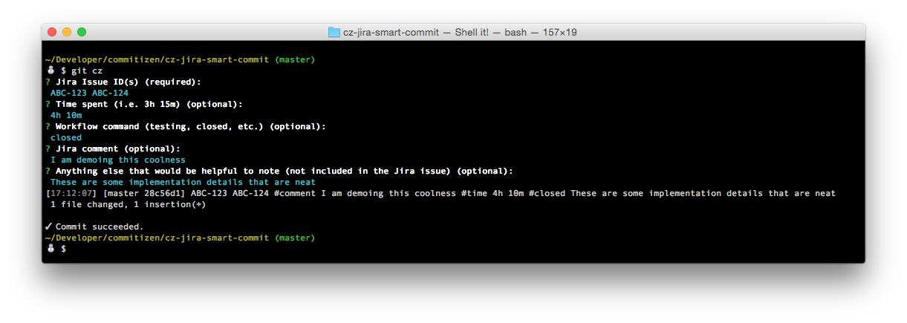

# cz-jira-smart-commit

[](https://greenkeeper.io/)

A commitizen adapter for [Jira smart commits](https://confluence.atlassian.com/display/FISHEYE/Using+smart+commits).



## Usage

### Global Installation

For a quick global installation of the plugin, simply run the `install.sh` script present in this repo:

```
chmod +x install.sh

./install.sh
```

### Add this adapter

Install this adapter

```
npm install cz-jira-smart-commit
```

Reference it in your `.cz.json` of your project

```json
{
  "path": "node_modules/cz-jira-smart-commit/"
}
```

or use commitizen to init
```
commitizen init cz-jira-smart-commit
```


### Day to day work

Instead of `git commit -m 'Your message'`, you type: `git cz` with this adapter and it prompts you for:

- commit message
- Jira Issue Key(s)
- Workflow command
- Time Spent
- Comment

And generates your commit based on that.

